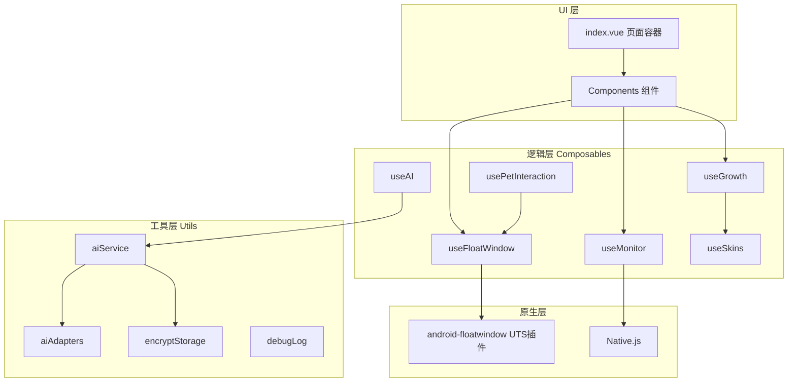
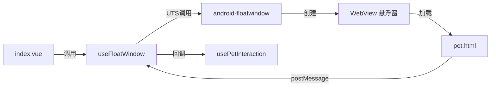
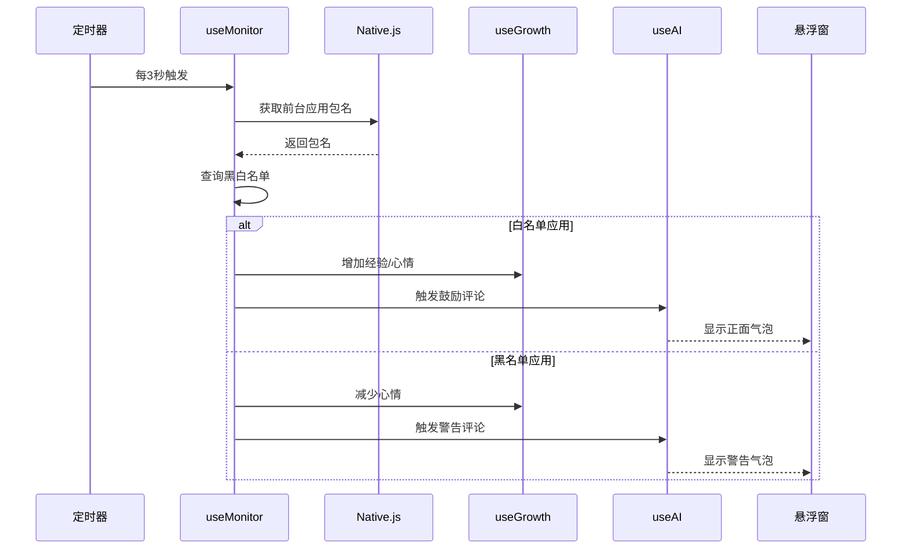
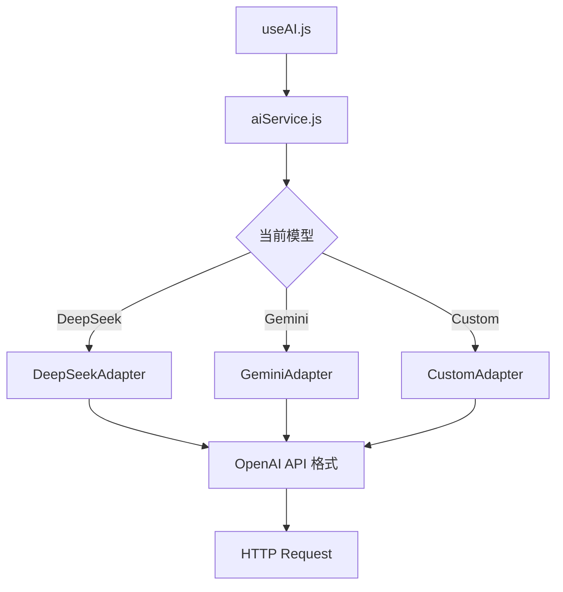
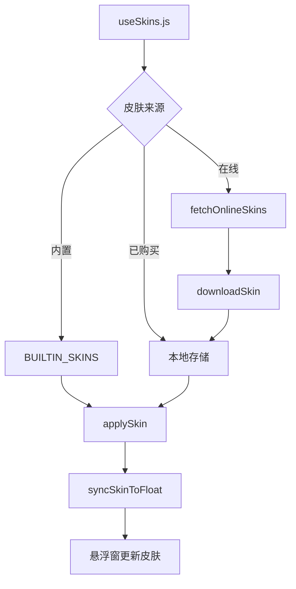
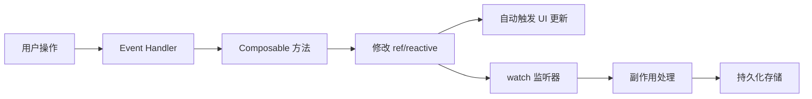

# WordParasite 架构设计文档

> **版本**: v2.0  
> **更新日期**: 2025-12-06  
> **目标读者**: 架构师、高级开发者、需要深度理解系统的 AI

---

## 📚 目录

- [系统架构总览](#系统架构总览)
- [分层设计](#分层设计)
- [核心子系统](#核心子系统)
- [设计模式应用](#设计模式应用)
- [数据流与状态管理](#数据流与状态管理)
- [性能优化策略](#性能优化策略)

---

## 🏗️ 系统架构总览

### 架构图



### 技术栈

| 层级 | 技术 | 说明 |
|------|------|------|
| **框架** | uni-app (Vue 3) | Composition API |
| **UI** | 纯 CSS | 赛博朋克/像素风格 |
| **状态管理** | Composable + ref/reactive | 响应式数据 |
| **原生能力** | UTS + Native.js | Android 原生 API |
| **AI** | DeepSeek/Gemini | 多模型适配 |
| **存储** | uni.storage + 加密 | 本地持久化 |

---

## 📐 分层设计

### 1. UI 层 (View Layer)

**职责**: 只负责渲染和用户交互，不包含业务逻辑

```vue
<!-- ✅ 正确示例 -->
<template>
  <view @click="handlers.handlePetInteract">
    <pet-screen :mood="growth.mood.value" />
  </view>
</template>

<script setup>
// 只做数据绑定，逻辑在 Composable 中
const growth = useGrowth();
const handlers = useIndexHandlers({ growth });
</script>
```

### 2. 逻辑层 (Composable Layer)

**职责**: 封装业务逻辑、状态管理、副作用处理

**模块化原则**:
- 单一职责 (Single Responsibility)
- 可复用 (Reusable)
- 可测试 (Testable)
- 文件行数 < 350 行

**依赖注入模式**:

```javascript
// useMonitor 依赖其他模块
export function useMonitor(options = {}) {
  const {
    useGrowthIntegration,     // 注入成长系统
    useAIIntegration,         // 注入 AI 系统
    sendToFloat               // 注入悬浮窗通信方法
  } = options;
  
  // 使用注入的依赖
  const handleGoodApp = (appName) => {
    useGrowthIntegration.rewardStudy(30);
    useAIIntegration.triggerPetComment(appName, 'good');
  };
  
  return { /* ... */ };
}
```

### 3. 工具层 (Utility Layer)

**职责**: 提供纯函数工具、适配器、通用服务

- `aiService.js` - AI 服务统一入口
- `aiAdapters.js` - 适配器集合
- `encryptStorage.js` - 加密存储
- `debugLog.js` - 日志工具

### 4. 原生层 (Native Layer)

**UTS 插件** (`android-floatwindow`):
- 创建悬浮窗
- WebView 通信
- 窗口拖拽和吸附

**Native.js**:
- 获取前台应用包名
- 应用列表扫描
- 权限申请

---

## 🎯 核心子系统

### 1. 悬浮窗系统

#### 架构设计



#### 关键组件

| 组件 | 职责 |
|------|------|
| `useFloatWindow.js` | 悬浮窗控制器 |
| `pet.html` | WebView 内容 |
| `usePetInteraction.js` | 互动协调器 |
| `useGestureRecognizer.js` | 手势识别 |
| `useBehaviorTree.js` | 状态管理 |

#### 通信协议

**消息类型表**:

| Type | 方向 | 用途 |
|------|------|------|
| `1` | App → Float | 显示文本气泡 |
| `2` | App → Float | 切换表情 |
| `50` | App → Float | 调整窗口尺寸 |
| `98` | App → Float | 切换动画状态 |
| `99` | App → Float | 同步皮肤数据 |
| `100` | Float → App | 手势事件 |
| `101` | Float → App | 拖拽事件 |

**消息格式**:

```javascript
// 发送到悬浮窗
floatWindow.sendMessageToFloat(1, JSON.stringify({
  text: "你好~",
  duration: 3000,
  emotion: "happy"
}));

// 从悬浮窗接收
const handleWebMessage = (type, data) => {
  if (type === 100) {
    const gesture = JSON.parse(data);
    // { gesture: 'TAP', x: 100, y: 200 }
  }
};
```

---

### 2. 应用监控系统

#### 工作流程



#### 核心逻辑

**时长统计**:

```javascript
// 每次切换应用时结算上一个应用的时长
const settleLastAppUsage = () => {
  const now = Date.now();
  const duration = (now - lastAppStartTime.value) / 1000 / 60; // 分钟
  
  if (lastAppPackage.value) {
    const isGoodApp = whitelist.includes(lastAppPackage.value);
    const minutes = Math.floor(duration);
    
    if (isGoodApp) {
      growth.rewardStudy(minutes);  // 学习奖励
    } else {
      growth.penaltyIdle(minutes);  // 摸鱼惩罚
    }
  }
};
```

**里程碑触发**:

```javascript
// 学习满30分钟触发奖励提示
if (minutes >= 30) {
  const reward = growth.rewardStudy(30);
  sendToFloat(1, `太棒了！${appName} 学习30分钟！🎉`);
}
```

---

### 3. AI 对话系统

#### 多模型架构



#### 适配器设计模式

**统一接口**:

```javascript
// aiAdapters.js
export class AIAdapter {
  async chat(userMessage, systemPrompt, history) {
    throw new Error('Must implement chat()');
  }
}

export class DeepSeekAdapter extends AIAdapter {
  async chat(userMessage, systemPrompt, history) {
    const messages = [
      { role: 'system', content: systemPrompt },
      ...history,
      { role: 'user', content: userMessage }
    ];
    
    const response = await uni.request({
      url: 'https://api.deepseek.com/v1/chat/completions',
      method: 'POST',
      data: { model: 'deepseek-chat', messages }
    });
    
    return response.data.choices[0].message.content;
  }
}
```

#### 降级策略 (4级)

| 级别 | 模式 | 触发条件 | 超时时间 |
|------|------|---------|---------|
| **Level 0** | 完整AI | 默认 | 10s |
| **Level 1** | 压缩AI | Level 0 超时 | 5s |
| **Level 2** | 本地模板 | 网络错误 | - |
| **Level 3** | 静态响应 | 彻底失败 | - |

**自动恢复**: 5分钟无错误后升回 Level 0

---

### 4. 成长系统

#### 数据模型

```javascript
{
  // 核心属性
  petType: 'ghost',        // 宠物类型
  petLevel: 1,             // 等级 (1-99)
  petXP: 0,                // 当前经验值
  mood: 80,                // 心情 (0-100)
  hunger: 100,             // 饥饿度 (0-100)
  bond: 0,                 // 亲密度 (0-100)
  coins: 128,              // 金币
  
  // 统计数据
  totalStudyTime: 0,       // 总学习时长 (分钟)
  todayStudyTime: 0,       // 今日学习时长
  totalIdleTime: 0,        // 总摸鱼时长
  todayIdleTime: 0,        // 今日摸鱼时长
  
  // 时间戳
  lastUpdateTime: Date.now()
}
```

#### 奖惩公式

**学习奖励** (来自 `growthFormula.js`):

```javascript
export function calculateStudyReward(minutes) {
  if (minutes >= 60) return { xp: 150, coins: 100, mood: 20 };
  if (minutes >= 30) return { xp: 60, coins: 30, mood: 15 };
  if (minutes >= 15) return { xp: 30, coins: 15, mood: 10 };
  if (minutes >= 5)  return { xp: 10, coins: 5, mood: 5 };
  return { xp: 0, coins: 0, mood: 0 };
}
```

**摸鱼惩罚**:

```javascript
export function calculateIdlePenalty(minutes) {
  if (minutes >= 180) return { mood: -50, coins: -50, hunger: -50 };
  if (minutes >= 60)  return { mood: -30, coins: -20, hunger: -20 };
  if (minutes >= 30)  return { mood: -20, coins: 0, hunger: -10 };
  if (minutes >= 10)  return { mood: -10, coins: 0, hunger: 0 };
  return { mood: 0, coins: 0, hunger: 0 };
}
```

#### 升级机制

```javascript
// 所需经验值 = 等级 * 100
const requiredXP = petLevel.value * 100;

if (petXP.value >= requiredXP) {
  petLevel.value++;
  petXP.value -= requiredXP;
  coins.value += 50;  // 升级奖励
}
```

---

### 5. 皮肤系统

#### 架构设计



#### 皮肤数据结构

```javascript
{
  id: 'default',
  name: '经典幽灵',
  author: 'WordParasite',
  version: '1.0.0',
  description: '神秘的电子幽灵',
  petType: 'ghost',
  
  // 解锁条件
  unlockCondition: {
    type: 'level',  // 'level' | 'coins' | 'achievement'
    value: 10
  },
  
  // 价格
  price: 0,  // 0 = 免费
  
  // 资源配置
  resources: {
    animations: {
      idle: 'css',     // 'css' | 'gif' | 'mp4'
      happy: 'css',
      angry: 'css'
    }
  },
  
  // 样式配置
  styles: {
    primaryColor: '#667eea',
    secondaryColor: '#764ba2',
    glowEnabled: true,
    bubbleStyle: 'cyberpunk'
  }
}
```

#### 解锁判定

```javascript
const checkUnlockCondition = (condition) => {
  switch (condition.type) {
    case 'level':
      return growth.petLevel.value >= condition.value;
    case 'coins':
      return growth.coins.value >= condition.value;
    case 'achievement':
      return achievements.isUnlocked(condition.value);
    default:
      return true;
  }
};
```

---

## 🎨 设计模式应用

### 1. 组合式函数模式 (Composable Pattern)

**优势**:
- 逻辑复用
- 依赖注入
- 易于测试

**示例**:

```javascript
// useIndexHandlers 作为事件处理器集合
export function useIndexHandlers(deps) {
  const { growth, ai, monitor, floatWindow } = deps;
  
  const handlePetInteract = () => {
    const result = growth.interact();
    ai.triggerPetComment('互动', 'good');
  };
  
  return { handlePetInteract };
}
```

### 2. 适配器模式 (Adapter Pattern)

**应用**: AI 多模型统一接口

```javascript
// 工厂函数
const ADAPTER_MAP = {
  'deepseek': DeepSeekAdapter,
  'gemini-flash': GeminiAdapter,
  'custom': CustomAdapter
};

const getAdapter = (modelId) => {
  const AdapterClass = ADAPTER_MAP[modelId];
  return new AdapterClass();
};
```

### 3. 状态机模式 (State Machine)

**应用**: 宠物行为树 (`useBehaviorTree.js`)

```javascript
const STATES = {
  IDLE: {
    subStates: ['normal', 'sleepy', 'bored', 'excited'],
    transitions: {
      on_interaction: 'INTERACTION',
      on_sleep: 'SLEEPING'
    }
  },
  INTERACTION: {
    subStates: ['greeting', 'chatting', 'playing'],
    transitions: {
      on_timeout: 'IDLE',
      on_angry: 'ANGRY'
    }
  },
  // ...
};
```

### 4. 观察者模式 (Observer Pattern)

**应用**: Vue 3 响应式系统

```javascript
// 监听心情变化
watch(() => growth.mood.value, (newMood) => {
  if (newMood < 20) {
    animations.playAngry();
  } else if (newMood > 80) {
    animations.playHappy();
  }
});
```

### 5. 策略模式 (Strategy Pattern)

**应用**: AI 降级策略

```javascript
const FALLBACK_STRATEGIES = {
  0: () => fullAIResponse(),
  1: () => compressedAIResponse(),
  2: () => templateResponse(),
  3: () => staticResponse()
};

const getResponse = (level) => {
  return FALLBACK_STRATEGIES[level]();
};
```

---

## 💾 数据流与状态管理

### 响应式数据流



### 状态持久化策略

| 数据类型 | 存储Key | 更新时机 | 加密 |
|---------|---------|---------|------|
| 成长数据 | `pet_growth_data` | 每次修改 | 否 |
| 聊天记录 | `chat_messages` | 每条消息 | 否 |
| API Key | `ai_api_keys` | 配置时 | ✅ 是 |
| 黑白名单 | `pet_whitelist/blacklist` | 添加/删除时 | 否 |
| 皮肤数据 | `current_skin` | 切换时 | 否 |
| 成就数据 | `pet_achievements` | 解锁时 | 否 |

### 跨组件状态共享

**方案 1: Composable 实例传递**

```javascript
// index.vue
const growth = useGrowth();
const handlers = useIndexHandlers({ growth });

// 传递给子组件
provide('growth', growth);
```

**方案 2: 全局单例 (慎用)**

```javascript
// 仅用于必须全局共享的状态
let globalGrowthInstance = null;

export function useGrowth() {
  if (!globalGrowthInstance) {
    globalGrowthInstance = createGrowthInstance();
  }
  return globalGrowthInstance;
}
```

---

## ⚡ 性能优化策略

### 1. 懒加载

**页面级懒加载**:

```javascript
// pages.json
{
  "pages": [
    { "path": "pages/index/index" },
    { "path": "pages/config/app-selector" }  // 仅在跳转时加载
  ]
}
```

**组件级懒加载**:

```vue
<script setup>
// 弹窗组件延迟导入
const SkinMarket = defineAsyncComponent(() => 
  import('./components/SkinMarket.vue')
);
</script>
```

### 2. 防抖与节流

**应用监控防抖**:

```javascript
// 避免频繁检测
let checkTimer = null;
const debouncedCheck = () => {
  clearTimeout(checkTimer);
  checkTimer = setTimeout(checkCurrentApp, 3000);
};
```

**手势识别节流**:

```javascript
// 防止快速连续触发
let lastTapTime = 0;
const handleTap = () => {
  const now = Date.now();
  if (now - lastTapTime < 300) return;  // 300ms 内忽略
  lastTapTime = now;
  // ...
};
```

### 3. 缓存策略

**应用列表缓存**:

```javascript
// 首次扫描后缓存
const cachedApps = uni.getStorageSync('installed_apps_cache');
if (cachedApps) {
  return cachedApps;
} else {
  const apps = scanInstalledApps();
  uni.setStorageSync('installed_apps_cache', apps);
  return apps;
}
```

### 4. 内存优化

**限制历史记录**:

```javascript
// 聊天记录最多保留 100 条
if (messages.value.length > 100) {
  messages.value = messages.value.slice(-100);
}

// 成长日志最多保留 50 条
if (growthLogs.value.length > 50) {
  growthLogs.value = growthLogs.value.slice(-50);
}
```

### 5. 渲染优化

**虚拟列表** (大数据量场景):

```vue
<!-- 使用 scroll-view 进行分页加载 -->
<scroll-view @scrolltolower="loadMore">
  <view v-for="item in visibleItems" :key="item.id">
    {{ item.name }}
  </view>
</scroll-view>
```

---

## 🔐 安全性设计

### 1. API Key 加密存储

```javascript
// encryptStorage.js
export function setSecure(key, value) {
  const encrypted = xorEncrypt(value, SECRET_KEY);
  uni.setStorageSync(key, encrypted);
}

export function getSecure(key) {
  const encrypted = uni.getStorageSync(key);
  return xorDecrypt(encrypted, SECRET_KEY);
}
```

### 2. 权限检查

```javascript
// 敏感操作前检查权限
const hasPermission = await checkFloatPermission();
if (!hasPermission) {
  requestPermission('float');
  return;
}
```

---

## 📊 可扩展性设计

### 1. 插件化架构

**AI 模型插件**: 新增模型只需添加适配器

```javascript
// aiAdapters.js
export class NewModelAdapter extends AIAdapter {
  async chat(userMessage, systemPrompt, history) {
    // 实现新模型的调用逻辑
  }
}

// 注册到工厂
ADAPTER_MAP['new-model'] = NewModelAdapter;
```

### 2. 皮肤市场扩展

**在线皮肤**: 支持 GitHub/CDN 拉取

```javascript
const fetchOnlineSkins = async () => {
  const response = await uni.request({
    url: 'https://api.github.com/repos/xxx/skins/contents'
  });
  return response.data;
};
```

---

## 📚 参考资源

- 📖 [开发者指南](./DEVELOPMENT.md) - 快速上手
- ✨ [功能清单](./FEATURES.md) - 完整功能
- 🛡️ [Bug 防范指南](./bug_prevention_guide.md) - 规范与最佳实践

---

**更新时间**: 2025-12-06  
**维护者**: WordParasite Team  
**License**: MIT
