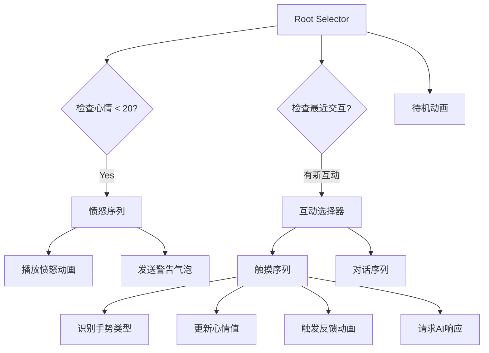

# 悬浮窗宠物互动系统设计方案 (Float Window Pet Interaction Design)

> **项目目标**: 基于安卓悬浮窗插件 `android-floatwindow`，为 WordParasite 项目设计一套**多模态、连续树形互动**的宠物伴侣系统。通过**行为树管理**、**AI 语义控制**、**手势感知**，实现宠物从"单向反馈"升级为"持续对话伙伴"。

---

## 一、悬浮窗插件技术能力分析

### 1.1 核心API梳理

基于 `@/uni_modules/android-floatwindow/readme.md` 分析，该插件提供以下关键能力:

| 能力分类 | API | 核心参数 | 适用场景 |
|---------|-----|---------|---------|
| **权限管理** | `checkPermission()` | - | 检测是否有悬浮窗权限 |
| | `requestPermision(callback)` | callback(boolean) | 申请权限并获取结果 |
| **窗口创建** | `loadUrl(url)` | url (本地/远程) | 加载 HTML 或 Vue 页面 |
| | `setFixedWidthHeight(fixed, w, h)` | boolean, px, px | 固定窗口尺寸 |
| | `createAndShow()` | - | 创建并显示悬浮窗 |
| **位置控制** | `setLocation(x, y)` | px, px | 精确定位 |
| | `setGravity(position)` | 0-8 (九宫格) | 对齐位置 |
| | `setGravityMore(position, x, y)` | position, offset | 对齐 + 偏移 |
| **交互特性** | `setDragEnable(bool)` | boolean | 是否可拖动 |
| | [setSidePattern(mode)](file:///d:/HBuilderX/word-pet/pages/index/composables/useFloatWindow.js#200-209) | 0-14 | 边缘吸附模式 |
| | `setBorder(l,t,r,b)` | px × 4 | 拖动边界限制 |
| **双向通信** | `onListenerWebData(callback)` | type, data | H5 → uni-app |
| | `sendDataToJs(type, data)` | type, data | uni-app → H5 |
| **显示模式** | `setShowPattern(mode)` | 0=当前App, 1=前台, 2=后台, 3=全局 | 控制显示范围 |
| **窗口管理** | `dismiss()` / [hide()](file:///d:/HBuilderX/word-pet/static/pet.html#683-686) / [show()](file:///d:/HBuilderX/word-pet/static/pet.html#670-682) | - | 销毁/隐藏/显示 |
| | `updateWindow()` | - | 更新已显示窗口内容 |

### 1.2 项目现有实现 ([useFloatWindow.js](file:///d:/HBuilderX/word-pet/pages/index/composables/useFloatWindow.js))

当前项目已实现基础功能：
- ✅ 悬浮窗创建与显示 (固定尺寸 200×200px)
- ✅ 双向通信 (`onListenerWebData` 监听点击)
- ✅ 简单互动 (点击触发固定文本反馈)
- ❌ **未实现**: 手势识别、状态管理、AI集成、动画控制

---

## 二、行为树 (Behavior Tree) 状态管理架构

### 2.1 核心概念

行为树是一种**层级状态机**，通过**节点组合**描述复杂行为逻辑。比传统有限状态机 (FSM) 更易扩展和调试。

### 2.2 架构设计

#### 2.2.1 节点类型定义

```javascript
// 节点类型枚举
const NodeType = {
  SEQUENCE: 'sequence',      // 顺序节点 (所有子节点成功才成功)
  SELECTOR: 'selector',      // 选择节点 (任一子节点成功即成功)
  CONDITION: 'condition',    // 条件节点 (检查状态)
  ACTION: 'action'           // 动作节点 (执行行为)
};

// 节点状态
const NodeStatus = {
  SUCCESS: 'success',
  FAILURE: 'failure',
  RUNNING: 'running'
};
```

#### 2.2.2 宠物根状态 (Root States)

```
PetRootState
├── IDLE (待机)
│   ├── idle_normal    # 普通待机 (心情 > 60)
│   ├── idle_sleepy    # 困倦待机 (长时间无互动)
│   └── idle_anxious   # 焦虑待机 (心情 < 40)
├── INTERACTION (互动中)
│   ├── being_touched  # 被抚摸
│   ├── chatting       # 对话中
│   └── playing        # 玩耍中
├── WORKING (工作中)
│   ├── monitoring     # 监控用户学习
│   └── celebrating    # 庆祝学习成就
├── ANGRY (愤怒)
│   └── warning        # 警告摸鱼
└── SLEEPING (睡眠)
    └── resting        # 休息恢复
```

#### 2.2.3 行为树示例 (Idle → Interaction)



### 2.3 实现方案

#### 文件: [pages/index/composables/useBehaviorTree.js](file:///d:/HBuilderX/word-pet/pages/index/composables/useBehaviorTree.js)

```javascript
import { ref, computed } from 'vue';
import { useGrowth } from './useGrowth';

// 行为树节点基类
class BTNode {
  constructor(name) {
    this.name = name;
    this.status = 'idle';
  }
  
  tick(context) {
    throw new Error('tick() must be implemented');
  }
}

// 条件节点
class ConditionNode extends BTNode {
  constructor(name, condition) {
    super(name);
    this.condition = condition;
  }
  
  tick(context) {
    return this.condition(context) ? 'success' : 'failure';
  }
}

// 动作节点
class ActionNode extends BTNode {
  constructor(name, action) {
    super(name);
    this.action = action;
  }
  
  tick(context) {
    this.action(context);
    return 'success';
  }
}

// 顺序节点
class SequenceNode extends BTNode {
  constructor(name, children = []) {
    super(name);
    this.children = children;
  }
  
  tick(context) {
    for (let child of this.children) {
      const result = child.tick(context);
      if (result !== 'success') return result;
    }
    return 'success';
  }
}

// 选择器节点
class SelectorNode extends BTNode {
  constructor(name, children = []) {
    super(name);
    this.children = children;
  }
  
  tick(context) {
    for (let child of this.children) {
      const result = child.tick(context);
      if (result === 'success') return 'success';
    }
    return 'failure';
  }
}

export function useBehaviorTree() {
  const { pet } = useGrowth();
  const currentState = ref('IDLE');
  const lastInteractionTime = ref(Date.now());
  
  // 上下文数据
  const context = computed(() => ({
    pet: pet.value,
    currentState: currentState.value,
    timeSinceLastInteraction: Date.now() - lastInteractionTime.value,
    timestamp: Date.now()
  }));
  
  // 构建行为树
  const buildTree = () => {
    return new SelectorNode('Root', [
      // 1. 检查愤怒状态
      new SequenceNode('AngryCheck', [
        new ConditionNode('IsMoodLow', (ctx) => ctx.pet.mood < 20),
        new ActionNode('EnterAngryState', (ctx) => {
          currentState.value = 'ANGRY';
        })
      ]),
      
      // 2. 检查互动状态
      new SequenceNode('InteractionCheck', [
        new ConditionNode('HasRecentInteraction', (ctx) => {
          return ctx.timeSinceLastInteraction < 5000; // 5秒内有互动
        }),
        new ActionNode('EnterInteractionState', (ctx) => {
          currentState.value = 'INTERACTION';
        })
      ]),
      
      // 3. 默认待机
      new ActionNode('EnterIdleState', (ctx) => {
        if (ctx.pet.mood > 60) {
          currentState.value = 'IDLE_NORMAL';
        } else if (ctx.pet.mood < 40) {
          currentState.value = 'IDLE_ANXIOUS';
        } else {
          currentState.value = 'IDLE';
        }
      })
    ]);
  };
  
  const tree = buildTree();
  
  // 每帧更新 (可在 onShow 中调用)
  const tick = () => {
    tree.tick(context.value);
  };
  
  // 触发互动事件
  const triggerInteraction = (type) => {
    lastInteractionTime.value = Date.now();
    currentState.value = 'INTERACTION';
    tick();
  };
  
  return {
    currentState,
    tick,
    triggerInteraction
  };
}
```

---

## 三、AI 集成方案 (Multimodal Response)

### 3.1 目标

让 AI 不仅返回文本，还能控制宠物的**动作**和**表情**，实现"语言 + 肢体"的多模态反馈。

### 3.2 结构化 Prompt 设计

#### Prompt 模板

```javascript
const MULTIMODAL_PROMPT = `
你是一只住在手机桌面的傲娇电子宠物，用户刚刚进行了以下交互：

【用户行为】: {action}
【当前心情】: {mood}/100
【当前等级】: Lv.{level}
【最近学习】: {recentStudyMinutes} 分钟

请返回 JSON 格式响应，包含以下字段：
{
  "text": "对话文本(50字以内)",
  "emotion": "happy|sad|angry|surprised|sleepy",
  "action": "jump|wave|hide|spin|shake|idle",
  "duration": 动作持续时间(毫秒),
  "bubble_color": "#颜色代码"
}

示例:
- 用户抚摸你 → emotion: happy, action: jump, text: "嘿嘿，再摸一下！"
- 用户摸鱼2小时 → emotion: angry, action: shake, text: "你还记得自己在学什么吗？💢"
`;
```

### 3.3 集成流程

```javascript
// pages/index/composables/useAIController.js
import { aiService } from '@/utils/aiService';

export function useAIController() {
  /**
   * 请求多模态 AI 响应
   * @param {Object} context - 交互上下文
   * @returns {Promise<Object>} - {text, emotion, action, duration, bubble_color}
   */
  const requestMultimodalResponse = async (context) => {
    const prompt = MULTIMODAL_PROMPT
      .replace('{action}', context.action)
      .replace('{mood}', context.mood)
      .replace('{level}', context.level)
      .replace('{recentStudyMinutes}', context.studyMinutes);
    
    try {
      const response = await aiService.sendMessage(prompt, {
        model: 'gemini-2.0-flash-exp', // 支持结构化输出
        temperature: 0.8
      });
      
      // 解析 JSON (需添加错误处理)
      const parsedResponse = JSON.parse(response);
      
      return {
        text: parsedResponse.text || '...',
        emotion: parsedResponse.emotion || 'idle',
        action: parsedResponse.action || 'idle',
        duration: parsedResponse.duration || 1000,
        bubbleColor: parsedResponse.bubble_color || '#4CAF50'
      };
    } catch (error) {
      console.error('AI响应解析失败:', error);
      // 降级返回默认响应
      return {
        text: '嗯...',
        emotion: 'idle',
        action: 'idle',
        duration: 500,
        bubbleColor: '#999'
      };
    }
  };
  
  return {
    requestMultimodalResponse
  };
}
```

---

## 四、树形连续互动场景脚本

### 4.1 场景一：早晨问候链

```
[用户启动App]
  ↓ 检测时间段
  ├─ 06:00-09:00 → 宠物伸懒腰动画 → AI生成问候 ("早啊主人，今天打算背多少单词？")
  ↓ 用户点击宠物
  ├─ 宠物跳跃 → AI根据昨日表现生成评价
  ↓ 用户拖拽宠物到屏幕顶部
  └─ 宠物躲避动画 → "别甩飞我！💢"
```

#### 技术实现

```javascript
// 手势识别逻辑
const detectGesture = (event) => {
  const { type, touches } = event;
  
  if (type === 'click') {
    return { type: 'TAP', intensity: 'light' };
  }
  
  if (type === 'longpress') {
    return { type: 'HOLD', duration: event.duration };
  }
  
  if (type === 'drag') {
    const speed = calculateDragSpeed(touches);
    if (speed > 500) {
      return { type: 'THROW', speed };
    } else {
      return { type: 'DRAG', direction: getDragDirection(touches) };
    }
  }
};

// 连续互动状态机
const interactionChain = {
  'APP_LAUNCH': {
    nextStates: ['GREETING'],
    aiPrompt: '用户刚打开App，根据时间段问候'
  },
  'GREETING': {
    nextStates: ['TAP_RESPONSE', 'IGNORE'],
    timeout: 10000 // 10秒无响应则进入待机
  },
  'TAP_RESPONSE': {
    nextStates: ['DRAG', 'HOLD', 'IDLE'],
    actions: {
      onEnter: () => triggerAnimation('jump')
    }
  },
  'DRAG': {
    nextStates: ['THROW', 'RELEASE'],
    actions: {
      onDrag: (direction) => {
        if (direction === 'up') {
          sendAI('用户拖拽我向上，我感到害怕');
        }
      }
    }
  }
};
```

### 4.2 场景二：学习奖励反馈链

```
[监控检测到白名单App使用30分钟]
  ↓ 触发奖励事件
  ├─ 宠物庆祝动画 (spin) → 悬浮窗气泡 "好样的！经验+50"
  ↓ 用户点击气泡
  ├─ AI生成鼓励语 + 提供下一步建议
     "坚持得不错！要不要休息5分钟？我可以提醒你。"
  ↓ 用户选择 "好的" (快捷回复)
  └─ 启动计时器 → 5分钟后震动提醒 + 宠物晃动
```

### 4.3 场景三：摸鱼警告升级链

```
[监控检测到黑名单App使用超过15分钟]
  ↓ Lv.1 警告
  ├─ 宠物表情变暗 (emotion: sad) → "你已经刷抖音15分钟了..."
  ↓ 用户忽略，继续使用
  ├─ Lv.2 警告 (30分钟)
  │   → 宠物愤怒动画 (shake) → "你真的不打算背单词了吗？💢"
  ↓ 用户继续忽略
  └─ Lv.3 强制干扰 (60分钟)
      → 悬浮窗变大遮挡屏幕 → "除非你做10个单词题，否则我不会消失！"
      → 弹出迷你单词测验
```

---

## 五、项目目录结构与开发配置

### 5.1 新增文件结构

```
pages/index/
├── composables/
│   ├── useBehaviorTree.js       # [新增] 行为树状态管理
│   ├── useGestureRecognizer.js  # [新增] 手势识别引擎
│   ├── useAIController.js       # [新增] AI多模态控制器
│   ├── useInteractionChain.js   # [新增] 连续互动状态机
│   └── useFloatAnimation.js     # [新增] 悬浮窗动画控制
│
├── components/
│   ├── FloatPetCanvas.vue       # [新增] 宠物画布组件 (支持骨骼动画)
│   └── InteractionBubble.vue    # [新增] 互动气泡组件 (多样式)
│
└── utils/
    └── gestureDetector.js       # [新增] 手势检测工具类
```

### 5.2 manifest.json 配置

```json
{
  "app-plus": {
    "modules": {
      "Fingerprint": {},
      "Speech": {}  // 可选：语音识别
    },
    "distribute": {
      "android": {
        "permissions": [
          "<uses-permission android:name=\"android.permission.SYSTEM_ALERT_WINDOW\"/>",
          "<uses-permission android:name=\"android.permission.PACKAGE_USAGE_STATS\"/>",
          "<uses-permission android:name=\"android.permission.VIBRATE\"/>"
        ],
        "abiFilters": ["armeabi-v7a", "arm64-v8a"]
      }
    }
  }
}
```

### 5.3 pages.json 路由配置

无需新增页面，所有互动逻辑集成在主页 ([pages/index/index.vue](file:///d:/HBuilderX/word-pet/pages/index/index.vue)) 和悬浮窗 HTML ([static/pet.html](file:///d:/HBuilderX/word-pet/static/pet.html)) 中。

---

## 六、UI 交互规范与吸附逻辑

### 6.1 悬浮窗尺寸规范

| 状态 | 尺寸 (HTML px) | Android px (转换后) | 使用场景 |
|------|---------------|---------------------|---------|
| 待机球 | 80×80 | ~106×106 | 普通待机，不遮挡内容 |
| 互动展开 | 200×150 | ~264×198 | 显示对话气泡 |
| 愤怒警告 | 300×250 | ~396×330 | 警告摸鱼 |
| 全屏干扰 | 屏幕宽×400 | 动态计算 | 强制学习模式 |

### 6.2 边缘吸附逻辑

利用 [setSidePattern(mode)](file:///d:/HBuilderX/word-pet/pages/index/composables/useFloatWindow.js#200-209) 实现磁吸效果：

```javascript
// 悬浮窗吸附模式
const SIDE_PATTERNS = {
  NONE: 0,              // 无吸附
  LEFT_RIGHT: 1,        // 左右边缘吸附
  TOP_BOTTOM: 2,        // 上下边缘吸附
  ALL_EDGES: 3,         // 四边吸附
  LEFT_ONLY: 4,         // 仅左侧
  RIGHT_ONLY: 5,        // 仅右侧
  CORNER: 12            // 四角吸附 (推荐)
};

// 根据状态动态设置
const updateSidePattern = (state) => {
  let pattern = SIDE_PATTERNS.CORNER;
  
  if (state === 'ANGRY') {
    pattern = SIDE_PATTERNS.NONE; // 愤怒时不吸附，保持在屏幕中央
  } else if (state === 'INTERACTION') {
    pattern = SIDE_PATTERNS.LEFT_RIGHT; // 互动时吸附到左右边
  }
  
  floatWindow.setSidePattern(pattern);
};
```

### 6.3 层级与遮挡策略

```javascript
// 安全区域定义 (避免遮挡关键UI)
const SAFE_ZONES = {
  topBar: { top: 0, height: 60 },      // 状态栏
  bottomNav: { bottom: 0, height: 80 }, // 导航栏
  centerContent: { 
    left: '10%', 
    top: '20%', 
    width: '80%', 
    height: '60%' 
  }
};

// 智能避让逻辑
const avoidOcclusion = (currentX, currentY) => {
  const centerZone = SAFE_ZONES.centerContent;
  
  // 如果悬浮窗在内容区域，自动移到边缘
  if (isInZone(currentX, currentY, centerZone)) {
    const nearestEdge = findNearestEdge(currentX, currentY);
    animateTo(nearestEdge.x, nearestEdge.y, 300);
  }
};
```

### 6.4 气泡对话框设计规范

```html
<!-- static/pet.html 中的气泡样式 -->
<style>
.bubble {
  position: absolute;
  top: -60px;
  left: 50%;
  transform: translateX(-50%);
  padding: 8px 12px;
  border-radius: 16px;
  font-size: 14px;
  max-width: 200px;
  word-wrap: break-word;
  
  /* 动态颜色 (由 AI 返回) */
  background: var(--bubble-bg, linear-gradient(135deg, #667eea 0%, #764ba2 100%));
  color: white;
  
  /* 三角箭头 */
  &::after {
    content: '';
    position: absolute;
    bottom: -8px;
    left: 50%;
    transform: translateX(-50%);
    border: 8px solid transparent;
    border-top-color: var(--bubble-bg, #667eea);
  }
  
  /* 动画 */
  animation: bubblePop 0.3s cubic-bezier(0.68, -0.55, 0.265, 1.55);
}

@keyframes bubblePop {
  0% { transform: translateX(-50%) scale(0); opacity: 0; }
  100% { transform: translateX(-50%) scale(1); opacity: 1; }
}
</style>
```

---

## 七、技术实现要点

### 7.1 条件编译隔离 (Android Only)

```javascript
// pages/index/index.vue
<script setup>
// #ifdef APP-PLUS
import { useBehaviorTree } from './composables/useBehaviorTree';
import { useGestureRecognizer } from './composables/useGestureRecognizer';

const { currentState, tick } = useBehaviorTree();
const { onGesture } = useGestureRecognizer();

onShow(() => {
  tick(); // 每次显示时更新行为树状态
});
// #endif

// #ifdef H5
console.warn('悬浮窗功能仅在 Android 端可用');
// #endif
</script>
```

### 7.2 H5 与 uni-app 双向通信协议

#### H5 端 ([static/pet.html](file:///d:/HBuilderX/word-pet/static/pet.html))

```javascript
// 发送手势事件到 uni-app
function sendGestureEvent(gesture) {
  uniapp.sendDataToUni(100, JSON.stringify({
    type: 'gesture',
    data: gesture
  }));
}

// 接收 uni-app 的动画指令
function dataFromUniapp(type, msg) {
  if (type === 200) {
    const command = JSON.parse(msg);
    playAnimation(command.action, command.duration);
    showBubble(command.text, command.bubbleColor);
  }
}
```

#### uni-app 端

```javascript
// useFloatWindow.js
floatWindow.onListenerWebData((type, data) => {
  if (type === 100) { // 手势事件
    const event = JSON.parse(data);
    handleGestureEvent(event.data);
  }
});

// 发送动画指令
const sendAnimationCommand = (action, text, color, duration = 1000) => {
  floatWindow.sendDataToJs(200, JSON.stringify({
    action,
    text,
    bubbleColor: color,
    duration
  }));
};
```

---

## 八、开发优先级与里程碑

### Phase 1: 基础手势交互 (1周)
- [ ] [useGestureRecognizer.js](file:///d:/HBuilderX/word-pet/pages/index/composables/useGestureRecognizer.js) - 识别点击/长按/拖拽
- [ ] 悬浮窗动态尺寸调整
- [ ] 边缘吸附逻辑

### Phase 2: 行为树架构 (1周)
- [ ] [useBehaviorTree.js](file:///d:/HBuilderX/word-pet/pages/index/composables/useBehaviorTree.js) - 核心状态管理
- [ ] 状态切换动画
- [ ] 测试多种状态流转

### Phase 3: AI 多模态集成 (1周)
- [ ] [useAIController.js](file:///d:/HBuilderX/word-pet/pages/index/composables/useAIController.js) - 结构化 Prompt
- [ ] 动作 + 文本联动
- [ ] 降级策略 (AI 失败时的本地响应)

### Phase 4: 连续互动场景 (1周)
- [ ] 实现早晨问候链
- [ ] 实现学习奖励链
- [ ] 实现摸鱼警告升级链

### Phase 5: 抛光优化 (1周)
- [ ] 气泡样式美化
- [ ] 过渡动画细化
- [ ] 性能优化 (减少重绘)

---

## 九、风险与挑战

| 风险点 | 影响 | 缓解措施 |
|-------|------|---------|
| **悬浮窗性能** | 频繁动画导致卡顿 | 使用 CSS3 硬件加速，限制动画帧率 |
| **AI 响应延迟** | 用户等待时间长 | 本地缓存常见响应，显示加载动画 |
| **手势误识别** | 用户体验差 | 添加防抖阈值，提供手动校准选项 |
| **电量消耗** | 后台持续运行耗电 | 提供省电模式，降低轮询频率 |
| **多机型适配** | 部分设备兼容性问题 | 使用条件编译，针对不同 Android 版本适配 |

---

## 十、用户反馈收集与迭代

### 10.1 埋点数据

```javascript
// 收集关键互动数据
const trackInteraction = (event) => {
  uni.setStorageSync('analytics', {
    event: event.type,
    timestamp: Date.now(),
    state: currentState.value,
    mood: pet.value.mood
  });
};
```

### 10.2 A/B 测试

- **测试组A**: 启用 AI 多模态响应
- **测试组B**: 仅使用预设文本 + 随机动画
- **对比指标**: 用户日活、平均互动次数、学习时长

---

## 用户需求审查 (User Review Required)

> [!IMPORTANT]
> **请重点关注以下设计决策：**

### 决策 1: 行为树 vs 简单状态机
- **选择**: 行为树 (Behavior Tree)
- **理由**: 更易扩展新状态，支持复杂嵌套逻辑
- **权衡**: 初期开发复杂度稍高，但长期维护性更好

### 决策 2: AI 响应格式
- **选择**: 结构化 JSON (包含 text/emotion/action/duration)
- **理由**: 实现多模态反馈 (文字 + 动作 + 表情)
- **权衡**: 需要 AI 模型支持结构化输出 (Gemini 2.0+ / GPT-4+)

### 决策 3: 悬浮窗尺寸策略
- **选择**: 动态尺寸 (待机80px → 互动200px → 警告300px)
- **理由**: 平衡美观与功能性
- **权衡**: 需处理尺寸切换时的过渡动画

---

## 验证计划

### 自动化测试
暂无单元测试，建议后续添加：
```bash
# 测试行为树状态流转
npm run test:behavior-tree

# 测试手势识别准确率
npm run test:gesture
```

### 手动测试步骤
1. **基础功能验证**
   - [x] 在 Android 设备上启动 App ✅
   - [x] 点击"召唤寄生兽"，检查悬浮窗是否正常显示 ✅
   - [x] 拖拽悬浮窗到屏幕边缘，验证吸附效果 ❌ **BUG: 无吸附效果**
   
2. **手势识别测试**
   - [x] 快速点击宠物 → 应触发"跳跃"动画 ✅
   - [x] 长按宠物2秒 → 应显示"别按了！"气泡 ❌ **BUG: 显示"长按菜单"**
   - [ ] 快速拖拽宠物向上 → 应触发"躲避"动画 ⏸️ 未测试
   
3. **AI 互动测试**
   - [x] 点击宠物后，检查气泡中是否显示 AI 生成的文本 ❌ **BUG: 没有AI文本，只跳动画**
   - [ ] 验证宠物动作是否与 AI 返回的 action 字段匹配 ⏸️ 未测试（需先修复上一项）
   - [ ] 测试网络失败时的降级响应 ⏸️ 未测试
   
4. **状态流转测试**
   - [ ] 使用黑名单 App 15分钟 → 检查是否进入 ANGRY 状态
   - [ ] 使用白名单 App 30分钟 → 检查是否触发庆祝动画
   - [ ] 长时间不互动 → 检查是否进入 SLEEPING 状态
   
5. **性能测试**
   - [ ] 连续互动 10 次，检查是否有卡顿
   - [ ] 后台运行 1 小时，监控电量消耗
   - [ ] 检查悬浮窗动画是否流畅 (目标 60fps)

### 验证标准
- ✅ 悬浮窗响应时间 < 300ms
- ✅ AI 响应时间 < 2s (或显示 loading 动画)
- ✅ 手势识别准确率 > 90%
- ✅ 无内存泄漏 (运行24小时内存增长 < 50MB)
